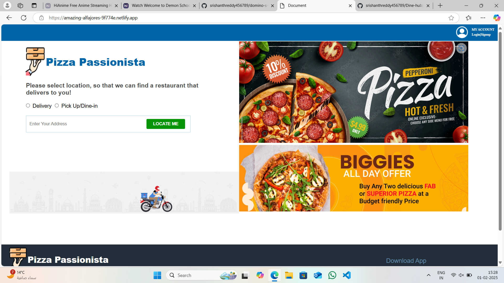
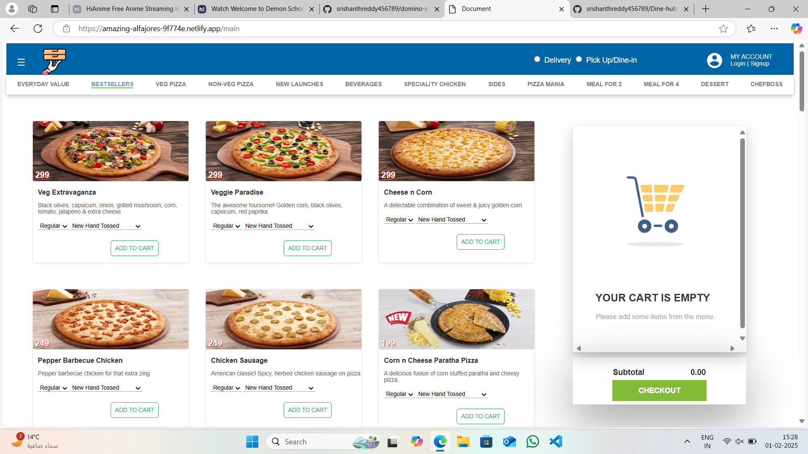
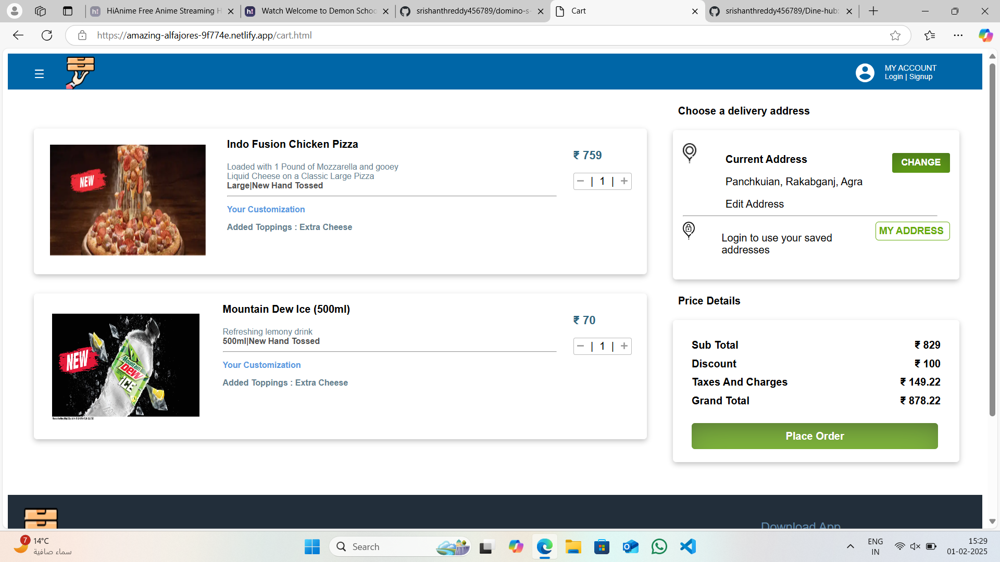

# Domino's-Clone-pizza's

**Domono's provides pizza delivery and carryout services as well as dine-in services through its restaurants.**

  
  

## 📸 Screenshots

Home Page:

 
 
Menu Page:
 

 
 
Cart Page:
 

 
 
Payment Section:
 

 
 
## 🚀 Features

- **Responsive Design** – Works seamlessly on all screen sizes.
- **Interactive UI** – Engaging animations and smooth scrolling.
- **Menu Showcase** – Displays restaurant menu items beautifully.
- **Contact Form** – Allows users to reach out easily.
- **Bootstrap Integration** – Ensures fast and flexible styling.
- **Optimized Performance** – Fast loading with clean code.

## 🛠️ Technologies Used

- **HTML5** – Structure of the website
- **CSS3** – Styling and responsiveness
- **JavaScript** – Interactivity and dynamic behavior
- **Bootstrap** – Grid system and pre-styled components

## 📜 License
This project is licensed under the MIT License. See the LICENSE file for details

## ✨ Author
👤 [Srishanth Reddy Narra] 
📧 Email: srishanthreddy456@gmail.com 
🔗 Mobile no: +91-8328214109 
📌 LinkedIn: [linkedin.com/in/yourprofile](https://www.linkedin.com/in/srishanth-reddy-narra-61a1142a0/)

 
